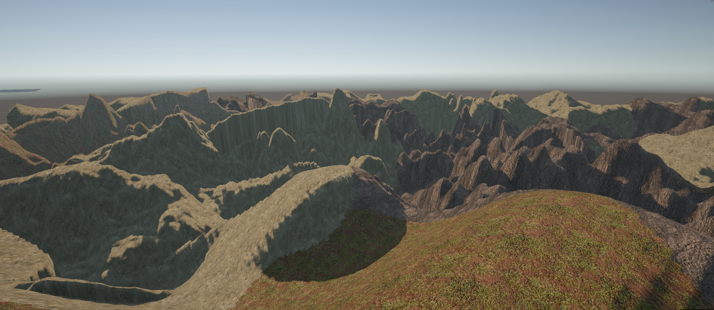

# Multi Terrain Generator

Multi Terrain Generator is a simple procedural terrain generator written in C# for Unity. It features the creation of a mesh, on which different terrain types are randomly distributed. A terrain type is defined by a material and its own surface structure. It's possible to create new terrains, as well as to modify the pattern how they are shaped and distributed on the mesh.
In its current state, it can be used as a tool to create a terrain asset in the scene. However, it is potentially possible to use this technology in a game with automatic terrain generation, or even realtime terrain generation. If I decide to spend more time on this project, i might go more in that direction.

This is still work in progress, so some features still don't work as they are supposed to. Currently, the generation is started by a button in the Unity inspector. In its current state, the application will generate the mesh only during one frame, so when a mesh with a very high triangle count is generated, it blocks the Unity UI. Furthermore, the surface structure of a terrain does not correctly align with its material. 
