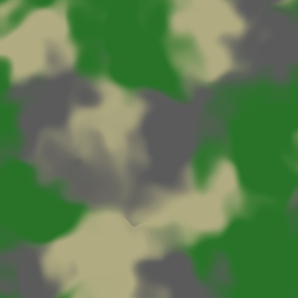

# Multi Terrain Generator

Multi Terrain Generator is a simple procedural terrain generator written in C# for Unity. It features the creation of a mesh, on which different terrain types are randomly distributed. A terrain type is defined by a material and its own surface structure. It's possible to create new terrains, as well as to modify the pattern how they are shaped and distributed on the mesh.
In its current state, it can be used as a tool to create a terrain asset in the scene. However, it is potentially possible to use this technology in a game with automatic terrain generation, or even realtime terrain generation. If I decide to spend more time on this project, I might choose to extend it in that direction.

## How it works

There are several parameters to control the result of the mesh generation. Some of them relate to overall properties of the mesh, like the mesh size, triangle resolution and height distribution. There are also parameters to specify the terrain segmentation, like the granularity and size of the terrain patches, as well as the border structure. Finally, there is the terrain type editor, in which new terrain types can be defined by another set of parameters. These include the material, but also parameters to control the terrain specific surface structure. 
When the generation process is started, the application first generates a texture which defines the distribution of the different terrain types, the segmentation map. Below, you see a graphical representation of this map. In fact the data structure behind the map contains not a color, but the actual share of every predefined terrain type on a point. This enables smooth interpolation from one terrain to the other.

Low border noise             |  Hight border noise			| Smoothed borders
:---------------------------:|:---------------------------:|:---------------------------:
 | |

In the next step a height map is generated, which is based on the segmentation map. It uses the terrain type specific parameters in combination with noise to represent the height structure of every terrain.

Low border noise             |  High border noise			| Smoothed borders
:---------------------------:|:---------------------------:|:---------------------------:
 | |

Both maps are used to create the final mesh. For each triangle the material is chosen depending on which terrain type has the highest share on this point on the segmentation map. The transition from one terrain to the other is mainly defined by the border noise amount and the border smoothing.

Low border noise             |  High border noise			| Smoothed borders
:---------------------------:|:---------------------------:|:---------------------------:
 | |
 | |

